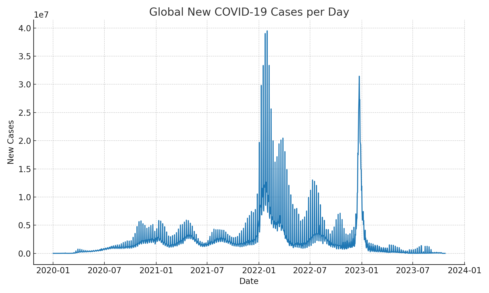
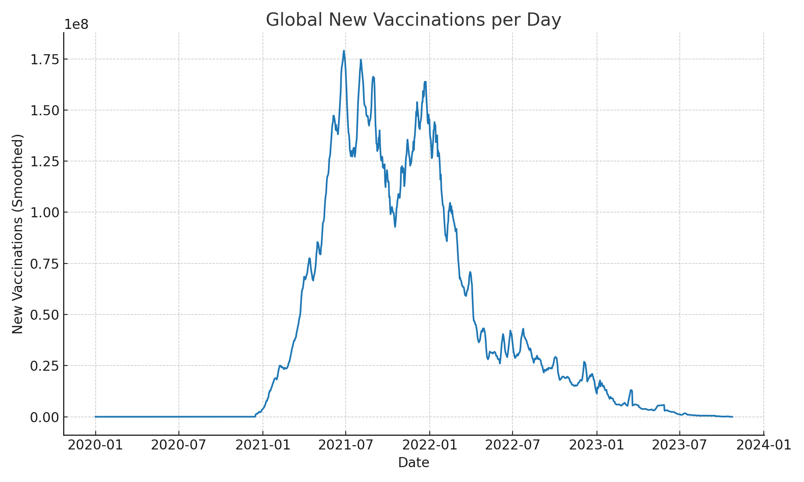
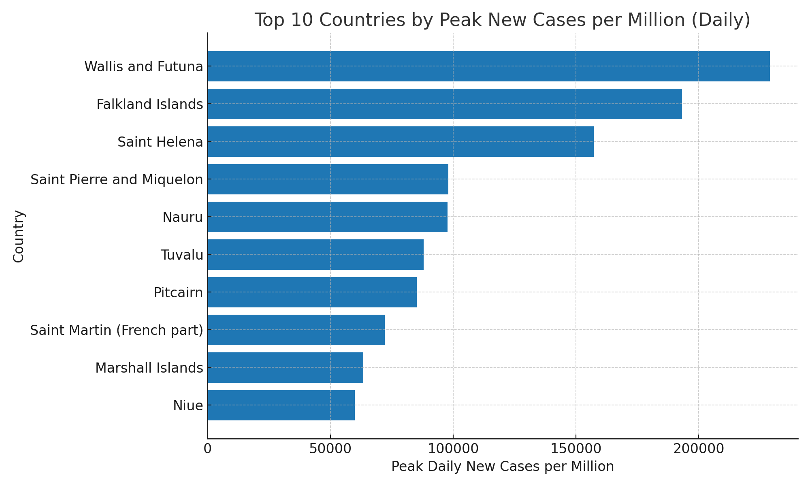
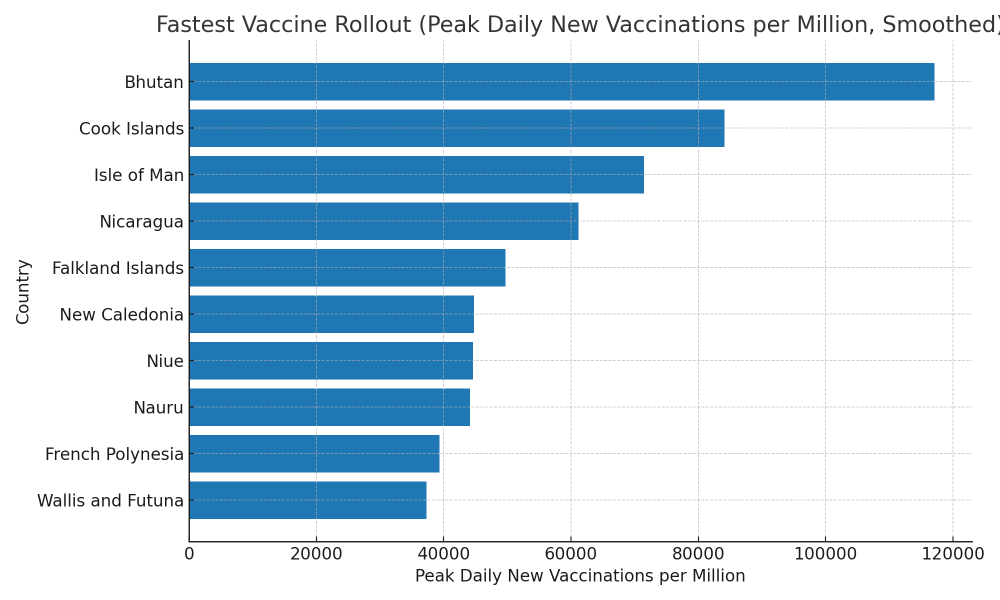

# COVID-19 Trends Analysis (OWID Data)

This project uses the **Our World in Data (OWID)** COVID-19 dataset to explore global trends, vaccination rollouts, and anomalies kept simple and human friendly

---

##  Project Overview
- Load and clean the dataset with **pandas**.
- Plot global **cases** and **vaccinations**.
- Compare **Top 10 countries** by:
  - Peak new cases (per million)
  - Fastest vaccination rollout (per million, smoothed)
- Check for **anomalies** (negative values, extreme spikes).
- Exported as a **Jupyter Notebook**, **PowerPoint deck**, and charts.

---

##  Repository Structure

```
notebooks/   → Jupyter Notebook (main analysis)
data/        → Dataset (owid-covid-data.csv)
reports/     → PowerPoint, CSV summary, exports
images/      → Generated charts (PNG)
```

---

##  Getting Started

###  Clone the repo
```bash
git clone https://github.com/thokozaniwisem/covid19-analysis.git
cd covid19-analysis
```

### Install dependencies
```bash
pip install -r requirements.txt
```

### Run the notebook
Open `notebooks/covid_trends_simple_analysis.ipynb` in:
- **Jupyter Notebook**
- **JupyterLab**
- **VS Code** (with Jupyter extension)

---

## Requirements
```
pandas
numpy
matplotlib
jupyter
python-pptx
nbformat
```

---

## Example Outputs

### Global Cases


### Vaccinations


### Top 10 Peaks


### Fastest Vaccine Rollout


---

## References
- Data source: https://ourworldindata.org/covid-dataset 